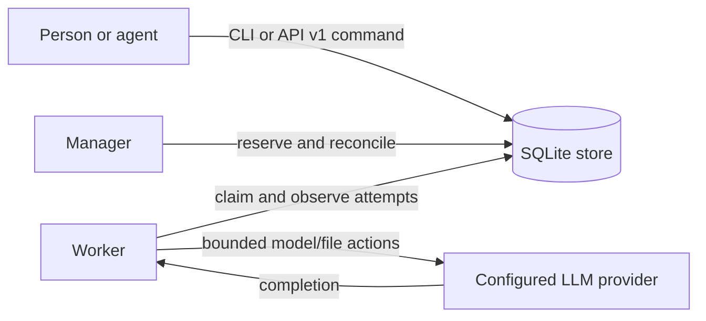

# Architecture

`boring-agent` has one local SQLite transaction domain and three long-lived roles:

- A submitted task is immutable after acceptance. The receipt identifies the command and task but does not promise execution success.
- The manager is the only component that creates reservations and decides retries. The worker is the only component that produces attempt observations.
- Idempotency is scoped to a caller command. A duplicate submit or cancel with the same payload returns its original receipt.
- Attempts are separate from tasks. A terminal task has one accepted outcome; an `Unknown` attempt retains capacity until an operator records independent evidence that it stopped.
- Results are written as artifacts and checked against the requested JSON Schema before a task becomes `Succeeded`.
  A `Succeeded` attempt whose artifact is missing or unreadable at settlement fails
  acceptance like a wrong result type and releases its reservation. One task's
  unexpected settlement fault is logged by error class only and does not stop
  other tasks from settling; that attempt is retried on the next tick.
- A tool call with an invalid path (including a NUL byte or non-UTF-8 text) or a
  failed file operation returns a tool error to the model and the attempt
  continues. File-operation errors carry only the errno name, OS reason and the
  workspace-relative path, never an absolute host path.
- Retention is resumable: task payload rows are removed in foreign-key order, while
  submit command rows remain as idempotency tombstones until their independent
  horizon. The final task-row deletion also removes any event recorded after the
  dependents phase (for example a late cancel), so one task cannot block later
  retention intents. Result bytes may expire separately; task and event history remains
  queryable and a missing retained result is reported as `gone`.
- Store opening applies one durable, versioned migration under `BEGIN IMMEDIATE`.
  A committed migration intent is resumed by the next opener, and unsupported
  future versions are rejected without mutation.
- A worker that stops heartbeating while its assignment is still queued has provably run nothing: the manager ends that attempt as a confirmed non-start and requeues the task without spending a retry. A launched attempt is never moved to another worker.
- Runners write their output to `logs/<attempt_id>.log` under the store home. A runner that cannot record its own process identity fails the attempt before starting, and a runner that exits without claiming is relaunched with exponential backoff.

The HTTP API and CLI use the same `Store` methods, so the API does not bypass durable acceptance or state transitions. The API server does not run a manager or worker: start those processes separately for each store.

## Provider boundary

`openai`, `anthropic`, and `ollama` remain stateless completion adapters. The
`coddy` provider is a separate session-aware adapter for `POST /v1/responses`.
It keeps one stable `X-Coddy-Session-ID` for a task, validates the session ID
returned in headers or stream metadata, and accepts both JSON and SSE results.
An SSE response is complete only after `data: [DONE]`; a truncated or malformed
stream is `Unknown` because remote completion cannot be disproved.

Before the first work turn, the runner reads `GET /v1/models` and uses only its
explicit `max_context_tokens` metadata to select a warm-up model. The configured
`BOA_MODEL` is retained when it advertises at least 100,000 context tokens; an
unadvertised model ID is never invented. The runner then inspects a requested
existing session or creates the task's deterministic session. A prepared session
is adopted only when its snapshot explicitly records successful `/compact` then
`/rpa-init`, either as command records or adjacent user-command/assistant-success
pairs; unrelated messages clear pending proof. A nonzero message count is not
preparation evidence. A new session
runs those commands in order, with each successful step recorded durably. A resumed session may inherit its current
permission mode only when that session snapshot exists; a missing or new session
starts at `ask` and cannot inherit bypass authority. A subagent mention serializes
`@agent:<name>` plus the complete `spawn_agent` argument object into the same
session. Its explicit permission mode is clamped to the parent's authority.

Coddy HTTP 409 and 429 responses are confirmed transient admission failures.
Known input and authorization failures are permanent. Connection loss,
ambiguous server failures, an incomplete stream, or an error after streamed
content retain `Unknown` semantics and are never replayed automatically.
This includes an error after any tool or possible side-effect event and a
`[DONE]`-only stream without a nonblank string `finish_reason` or
`coddy_meta.stop_reason`.
