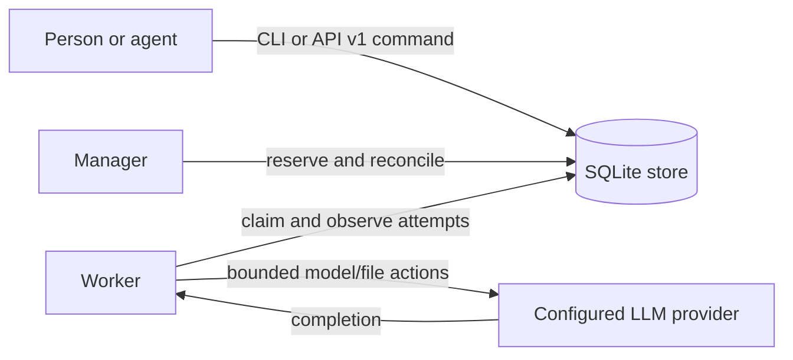

# Architecture

`boring-orch-agent` has one local SQLite transaction domain and three long-lived roles:

- A submitted task is immutable after acceptance. The receipt identifies the command and task but does not promise execution success.
- The manager is the only component that creates reservations and decides retries. The worker is the only component that produces attempt observations.
- Idempotency is scoped to a caller command. A duplicate submit or cancel with the same payload returns its original receipt.
- Attempts are separate from tasks. A terminal task has one accepted outcome; an `Unknown` attempt retains capacity until an operator records independent evidence that it stopped.
- Results are written as artifacts and checked against the requested JSON Schema before a task becomes `Succeeded`.
- Retention is resumable: task payload rows are removed in foreign-key order, while
  submit command rows remain as idempotency tombstones until their independent
  horizon. Result bytes may expire separately; task and event history remains
  queryable and a missing retained result is reported as `gone`.
- Store opening applies one durable, versioned migration under `BEGIN IMMEDIATE`.
  A committed migration intent is resumed by the next opener, and unsupported
  future versions are rejected without mutation.
- A worker that stops heartbeating while its assignment is still queued has provably run nothing: the manager ends that attempt as a confirmed non-start and requeues the task without spending a retry. A launched attempt is never moved to another worker.
- Runners write their output to `logs/<attempt_id>.log` under the store home. A runner that cannot record its own process identity fails the attempt before starting, and a runner that exits without claiming is relaunched with exponential backoff.

The HTTP API and CLI use the same `Store` methods, so the API does not bypass durable acceptance or state transitions. The API server does not run a manager or worker: start those processes separately for each store.
